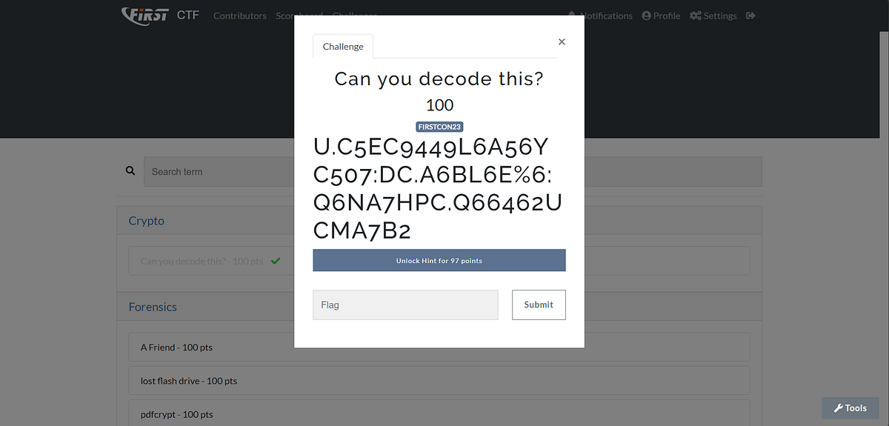
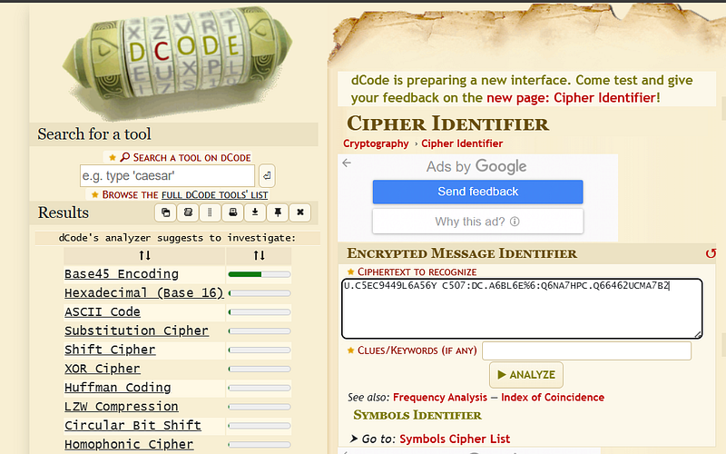
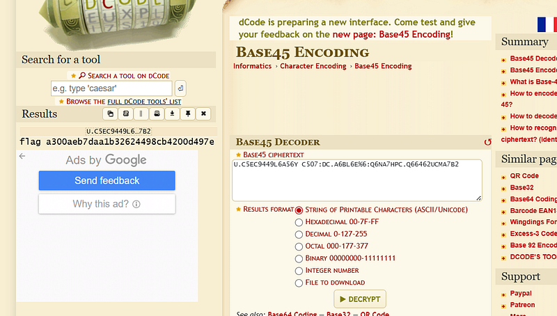

# Can-you-decode-this (Write-up)
FIRST CTF's Challenge Write up (Crypto)

บ้อความในโจทย์ คือ

> **Ciphertext:** `U.C5EC9449L6A56YC507:DC.A6BL6E%6:Q6NA7HPC.Q66462UCMA7B2`

---

เลือกใช้เครื่องมือช่วยอย่างเว็บ [dCode.fr (Cipher Identifier)](https://www.dcode.fr/cipher-identifier) เพื่อวิเคราะห์หาความเป็นไปได้ของ Cipher นี้ ผลปรากฏว่าระบบตรวจพบว่าน่าจะเป็นการเข้ารหัสด้วย **Base 45** ตามรูปด้านล่าง

---

จากนั้นเราก็เอาไป decode ตามปกติก็จะได้ flag ออกมา

---

*For Educational Purpose Only*
