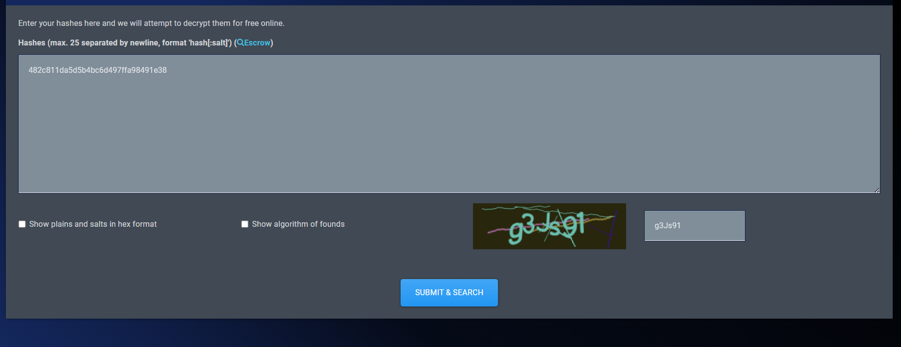
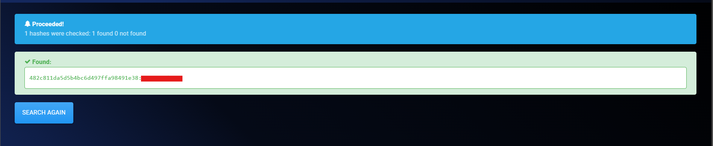
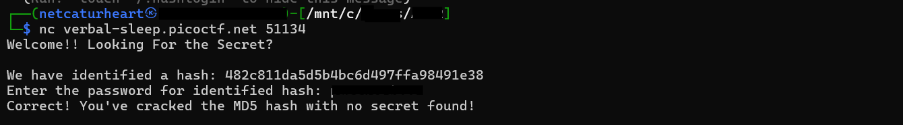
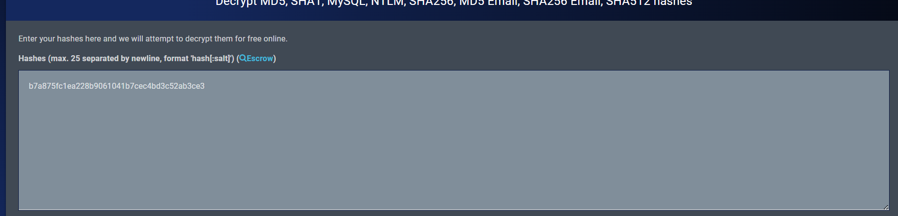
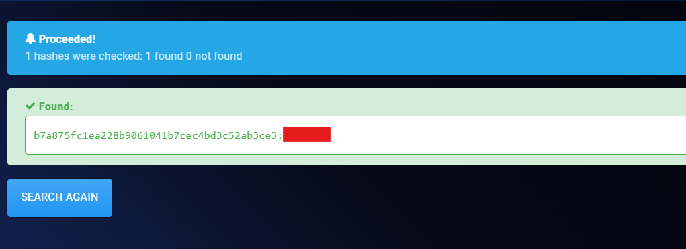
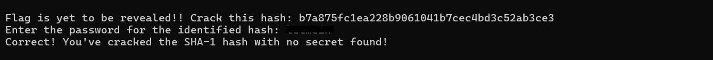
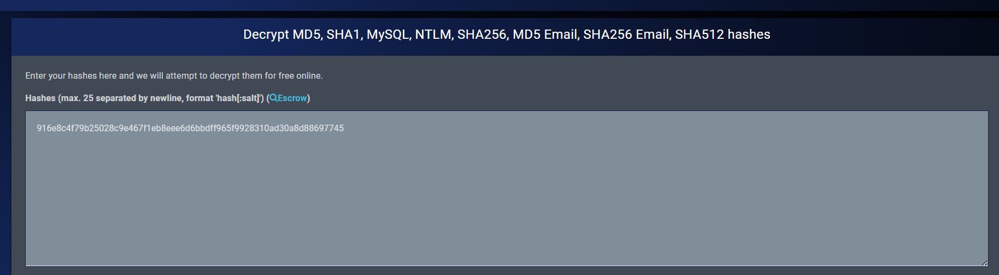
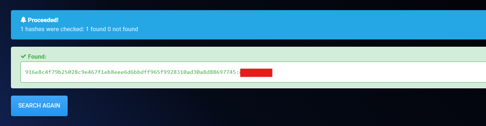
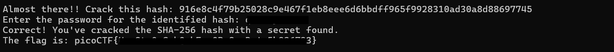

# hashcrack (Write-up)
Easy picoctf Write up (Crypto)

### Description
A company stored a secret message on a server which got breached due to the admin using weakly hashed passwords. Can you gain access to the secret stored within the server? Additional details will be available after launching your challenge instance.

**คำแปล** 
> `บริษัทเก็บข้อความลับไว้บนเซิร์ฟเวอร์ แต่ระบบดันถูกเจาะเพราะแอดมินใช้รหัสผ่านที่มีการแฮชแบบอ่อนแอเกินไป คุณช่วยหาทางเข้าถึงความลับที่เก็บไว้ในเซิร์ฟเวอร์นี้ได้ไหม? รายละเอียดเพิ่มเติมจะแสดงขึ้นหลังจากที่คุณกดเปิด Instance ของโจทย์`

---
1. ทำการเชื่อมต่อเข้าไปที่เซิร์ฟเวอร์ที่ได้มาจากการ start instance ก่อน จะเจอกับค่า hash เสร็จแล้วให้เอาค่านั้นไปเข้าเว็บ https://hashes.com/en/decrypt/hash พอได้รหัสผ่านก็ให้กรอกได้เลยแต่โจทย์จะบอกว่าเราต้องทำการถอดรหัสค่าแฮชอีก เพราะยังไม่จบ
   

   

---
2.  คราวนี้ได้แฮชมาอีกก็ทำเหมือนเดิมกับข้อที่ 1 แต่ flag ก็ยังไม่โผล่มาเช่นเดิม

   

---
3. ทำเช่นเดียวกับข้อ1,2 คราวนี้จะได้ flag โผล่มาเป็นอันจบ

   

---

*For Educational Purpose Only*
